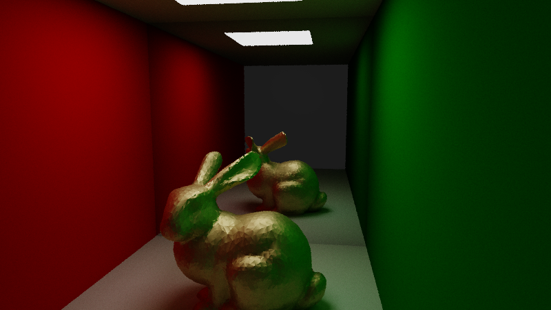
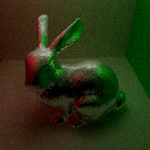

# Path tracer on CUDA

Simple path tracer renderer using CUDA.

# Features

- Path tracer on CUDA
  - BRDF
    - Specular reflection
  - Monte Carlo integration
  - NEE
- BVH Acceleration
  - BVH construction using SAH
  - [DEPRECATED] BVH construction using clustering algorithm
    - 
  
  - Non recursive BVH traverse
  
- Simple scene viewer on OpenGL 4.6
  - For now,  rendering cluster of polygons is all.

### To be implemented later...

- Refraction,...
- optimizations.,
  - metropolis light transformation?

- Scene loading and exportation using json file.

# License

This project contains code from following open source software

1. **[yocto-gl](https://github.com/xelatihy/yocto-gl)**
   1. License : MIT license
   2. Download : [xelatihy/yocto-gl: Yocto/GL: Tiny C++ Libraries for Data-Driven Physically-based Graphics (github.com)](https://github.com/xelatihy/yocto-gl)
   3. Where, in my project : In include/Bxdf.cuh
2. [single-file public domain libraries for C/C++ (github.com)](https://github.com/nothings/stb)
   1. License : MIT license
   2. Download : [nothings/stb: stb single-file public domain libraries for C/C++ (github.com)](https://github.com/nothings/stb)
   3. Where, in my project : In include/stb_image.h, stb_image_write.h

3. [ASSIMP](https://github.com/assimp/assimp)
   1. License : see License on this repository
   2. Download  :https://github.com/assimp/assimp
   3. Where, in my project : In include/Model.h, include/Mesh.h, src/Model.cpp, src/Mesh.cpp

# Rendered images...

1. Image for comparision of image with NEE and one without. (16spp)

 

2. Diffuse room

3. Mirror bunny

