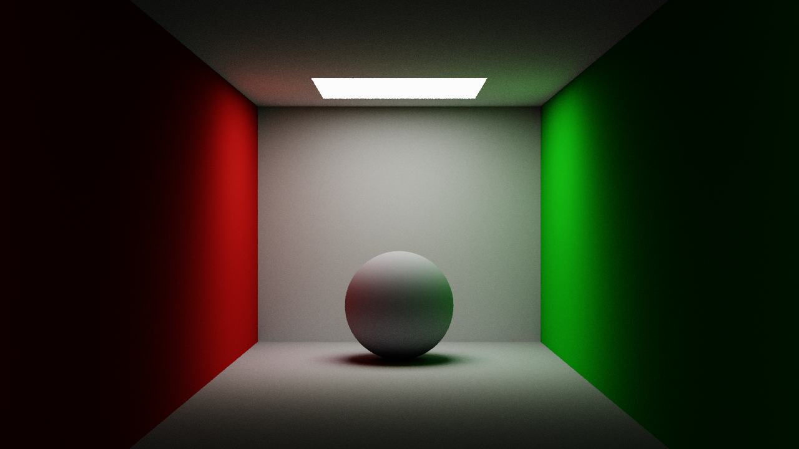
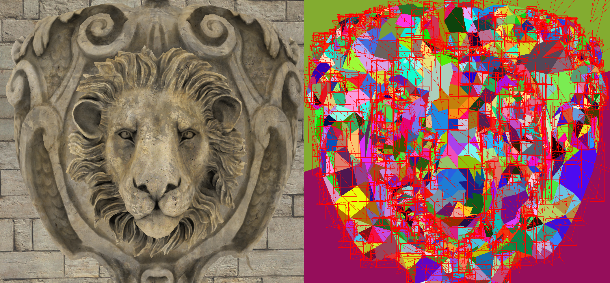

# Path tracer on CUDA

Simple path tracer renderer using CUDA.

# Features

- Diffuse reflection (Lambertian)
- BVH construction using clustering algorithm
  - 
- Simple scene viewer on OpenGL 4.6

### To be implemented later...

- BVH travese on GPU
- Scene loading and exportation using json file.

